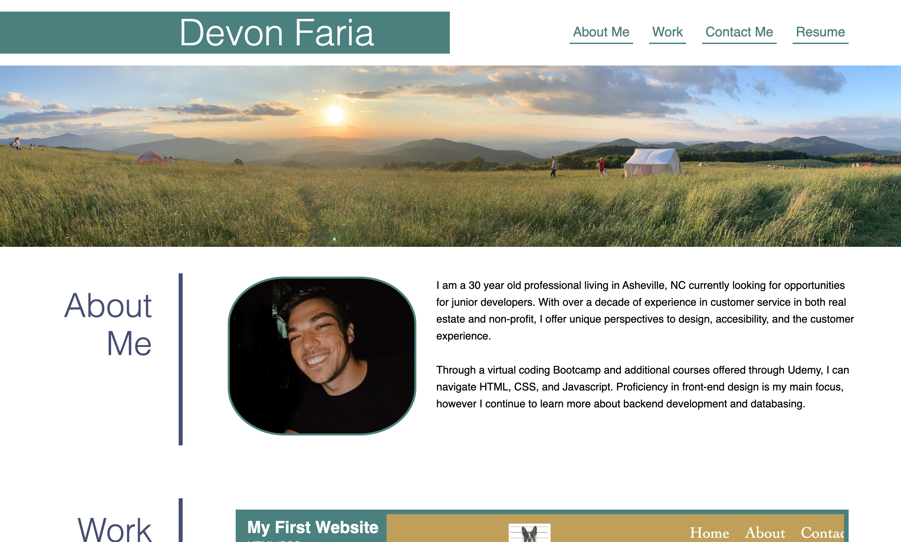
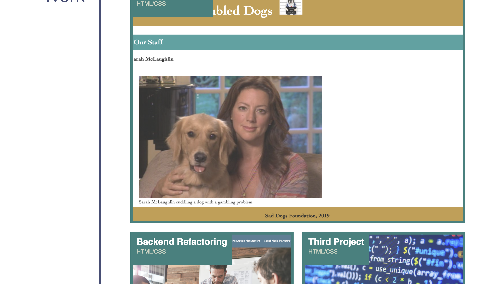

# Devon Faria - Professional Portfolio

[Link to working page](https://devonfaria.github.io/professional-portfolio/)

## Table of Contents

* [Description](#description)
* [Visuals](#visuals)
* [Support](#Support)
* [Contributions](#contributions)

## Description

Welcome to the backend of the landing page for my professional protfolio! This project only uses one html and one css file, with a folder of images for your convenience. Use this page format for your own purposes!

The web page when deployed will have links to the page sections in the nav bar, a screen-responsive design, clickable image links to separate web applications, and a contact me section with links. 

## Visuals

The following layout is what you can expect to see on your browser.

## Support

Contact me at devonfaria@gmail.com if you need assistance downloading or activating this repository.

## Contributions

A huge thank you to the UNCC Virtual Bootcamp for providing me with the knowledge to create such a beautiful webpage, and the support to code it correctly!